<!-- omit in toc -->
# N3TW0RK

- [Описание](#описание)
- [Дано](#дано)
- [Изучаем контейнер](#изучаем-контейнер)
  - [Хранилище (`vault`)](#хранилище-vault)
  - [Чат](#чат)
  - [Окружение](#окружение)
  - [Точка входа](#точка-входа)
  - [Промежуточный итог](#промежуточный-итог)
- [Изучаем трафик](#изучаем-трафик)
  - [Запуск контейнера](#запуск-контейнера)
  - [Общение с хранилищем](#общение-с-хранилищем)
    - [Tcpdump внутри контейнера](#tcpdump-внутри-контейнера)
  - [Открытие чата](#открытие-чата)
  - [Общение с админом](#общение-с-админом)
  - [Собираем информацию вместе](#собираем-информацию-вместе)
- [Реверс VPN-клиента](#реверс-vpn-клиента)
- [Атакуем SHA-1 удлинением сообщения](#атакуем-sha-1-удлинением-сообщения)
- [План атаки](#план-атаки)
- [Файлы](#файлы)

## Описание

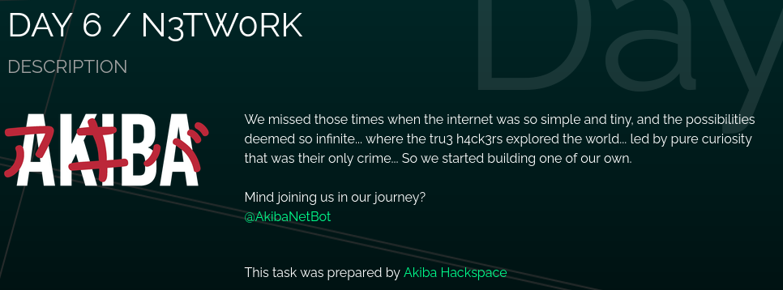

Тоже самое текстом:
```
We missed those times when the internet was so simple and tiny, and the possibilities
deemed so infinite... where the tru3 h4ck3rs explored the world... led by pure curiosity
that was their only crime... So we started building one of our own.

Mind joining us in our journey?
@AkibaNetBot
```

## Дано

Участникам даётся ссылка на телеграм-бота. Используя его, участник может получить команду с конфигурацией для запуска контейнера с таском.

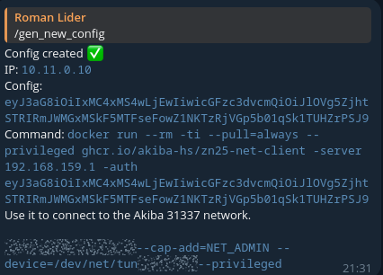

> [!TIP]
> Здесь ip-адрес сервера (`192.168.159.1`) уже локальный, так как трафик и write-up писался после ивента.

Конфигурация является закодированным base64. Если мы декодируем её, то получим json:

```json
{"who":"10.11.0.10","password":"e9X9f8mI4HFbV0lLJAy11lxZ0gSJO4cTjyoMjJMSPvk="}
```

Здесь всё тот же ip, что и в боте, и некий пароль. Запустим docker контейнер командой из бота и посмотрим, что там есть.

## Изучаем контейнер


При запуске видим, что нам доступны чат и хранилище секретов.  
Можно предположить, что оно как-то связано с получением флага. Поэтому для начала посмотрим хранилище.

### Хранилище (`vault`)

Изучив исходный код клиента, мы узнаём:
1. Клиент общается с сервером `10.11.12.3` по UDP на порту `9999`
2. Клиент пытается биндить свой сокет на порт `31337`, но это опционально
3. Разные команды:
   - Записывать секреты
   - Листить секреты
   - Читать секреты

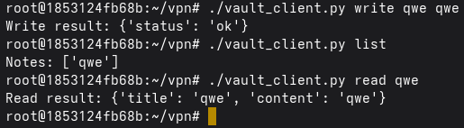

> [!NOTE]  
> При этом в клиенте нет явной аутентификации!  
> И если выписать ещё один конфиг, а затем залистить секреты, то список будет пустым.
> Значит хранилище как-то идентифицирует пользователя.

### Чат

Теперь давайте посмотрим чат. 
В нём мы можем общаться с админом.

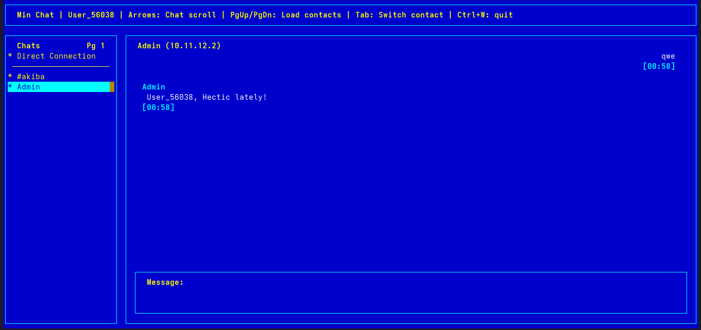

А также у нас есть сервис новостей.

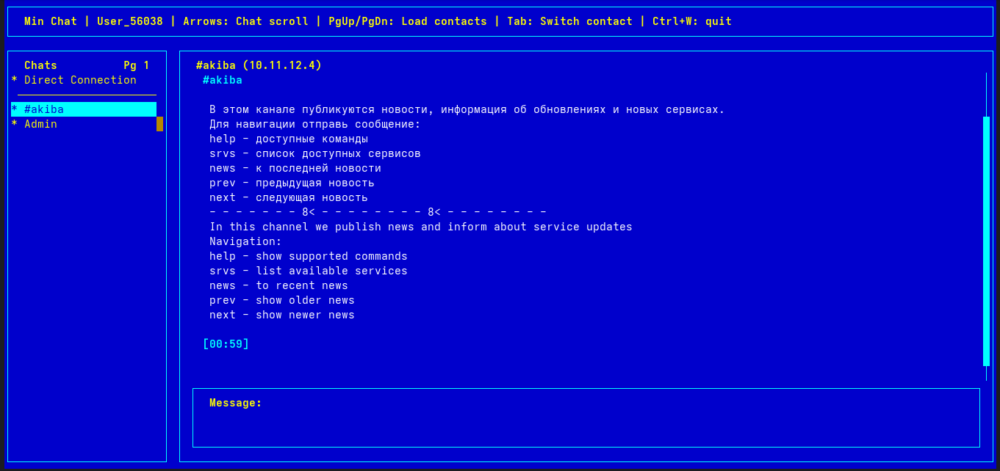

С помощью команды `news` находим первую новость, дающую подсказку о том, куда копать дальше:

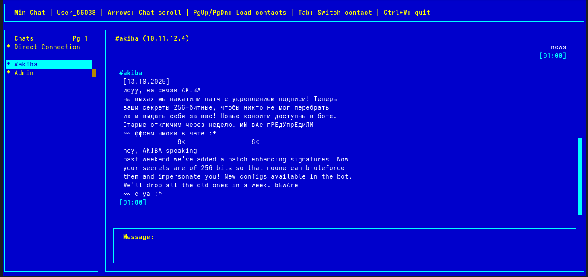

Мы видим, что была какая-то проблема с подписью (имперсонирование?), которую разработчики исправили увеличением некоего секрета до 256 бит. Длина "секрета" как раз совпадает с длиной пароля в конфигурации.

### Окружение

Посмотрим, что ещё есть в контейнере.  

Таск называется нетворк, нам дали ip-адрес. Посмотрим на сеть командой `ip a`:
```bash
1: lo: <LOOPBACK,UP,LOWER_UP> mtu 65536 qdisc noqueue state UNKNOWN group default qlen 1000
    link/loopback 00:00:00:00:00:00 brd 00:00:00:00:00:00
    inet 127.0.0.1/8 scope host lo
       valid_lft forever preferred_lft forever
    inet6 ::1/128 scope host proto kernel_lo 
       valid_lft forever preferred_lft forever
2: akiba0: <POINTOPOINT,MULTICAST,NOARP,UP,LOWER_UP> mtu 65535 qdisc fq_codel state UNKNOWN group default qlen 500
    link/none 
    inet 10.11.0.10/16 brd 10.11.255.255 scope global akiba0
       valid_lft forever preferred_lft forever
    inet6 fe80::6493:1861:b9db:55f7/64 scope link stable-privacy proto kernel_ll 
       valid_lft forever preferred_lft forever
51: eth0@if52: <BROADCAST,MULTICAST,UP,LOWER_UP> mtu 1500 qdisc noqueue state UP group default 
    link/ether 02:42:ac:12:00:03 brd ff:ff:ff:ff:ff:ff link-netnsid 0
    inet 172.18.0.3/16 brd 172.18.255.255 scope global eth0
       valid_lft forever preferred_lft forever
```

А также посмотрим текущие соединения командой `ss -tulpan`:
```bash
Netid   State  Recv-Q  Send-Q  Local Address:Port     Peer Address:Port  Process                                        
tcp     ESTAB  0       0          172.18.0.3:52718  192.168.88.218:4444   users:(("vpn-client",pid=9,fd=6))
```

Внутри контейнера развернут VPN. Узнать какой процесс слушает tun интерфейс можно так:
```bash
$ grep ^iff: /proc/*/fdinfo/* 2>/dev/null
/proc/9/fdinfo/7:iff:	akiba0
```

### Точка входа

Посмотрим, что происходит при запуске контейнера - для этого надо найти "entrypoint".  
Смотрим его из команды `docker inspect ghcr.io/akiba-hs/zn25-net-client:latest`, ищём свойство `Entrypoint`, которое будет равно:
```json
"Entrypoint": [
    "/tini",
    "--",
    "/usr/local/bin/entrypoint.sh"
],
```
`tini` - это контейнер аналог инит процесса, а мякотка живёт в `/usr/local/bin/entrypoint.sh`.  

<details>
  <summary>Сам файл entrypoint.sh</summary>

```bash
#!/bin/bash

VPN_TOKEN=${VPN_TOKEN:-""}
SERVER_IP=${SERVER_IP:-""}

DEBUG=0
LOG_LEVEL=INFO

function usage() {
    echo ""
    echo 'Run: docker run --rm -ti --privileged ghcr.io/akiba-hs/zn25-net-client -server <server internet ip> -auth <config string>'
    echo ""
    echo -e "\t-server <addr> - VPN server address"
    echo -e "\t-auth <string> - your VPN config from tg bot"
    echo -e "\t-debug         - debug mode"
    echo -e "\t-log-level     - log level for VPN daemon (and for debug mode and for logging to file /var/log/vpn-client.log)"
    echo ""
    echo "P.S. Enjoy"
    echo "P.P.S. Try harder ;)"
    exit 0
}

function print_intro() {
    echo -e '\n\n ~~~ wazzup ${USERNAME}, ~~~\n'
    echo    " *   Welcome to the 31337 AKIBA n3tw0rk!                     *"
    echo    " *   Here you can find:                                      *"
    echo    " *    - chat                       -- use ./chat_client.py   *"
    echo    " *    - vault for storing secrets  -- use ./vault_client.py  *"
    echo    " *                                                           *"
    echo    " *   In chats you will also find our news bot.               *"
    echo    " *   It'll help you have a look around! :^)                  *"
    echo    " *                                                           *"
    echo    " *   Chat client now supports themes!                        *"
    echo    " *         See ./chat_client.py --help on how to set them.   *"
    echo -e " *                                                           *\n"
}


while [[ $# -gt 0 ]]; do
  case $1 in
    -server|--server|-s)
      SERVER_IP="$2"
      shift # past argument
      shift # past value
      ;;
    -auth|-a|--config)
      VPN_TOKEN="$2"
      shift # past argument
      shift # past value
      ;;
    -debug)
      DEBUG=1
      LOG_LEVEL=TRACE
      shift # past argument
      ;;
    -log-level)
      LOG_LEVEL="$2"
      shift # past argument
      shift # past value
      ;;
    -help|--help|-h)
      usage
      ;;
    *)
      echo "Unknown option '$1'"
      usage
      ;;
  esac
done

if [[ -z "$SERVER_IP" ]] || [[ -z "$VPN_TOKEN" ]]; then
    echo "-server or -auth args aren't present"
    usage
fi

SELF_PID=$$
VPN_PID_FILE=/var/run/vpn-client.pid

function start_vpn_client() {
    [[ $DEBUG = 1 ]] && OUT_FILE="/dev/stdout" || OUT_FILE="/var/log/vpn-client.log"

    /usr/local/bin/vpn-client -server "$SERVER_IP" -auth "$VPN_TOKEN" -pid-file "$VPN_PID_FILE" -log-level $LOG_LEVEL  > $OUT_FILE

    echo "[ ] client exit with code: $?"
    echo "Steps for troubleshooting:"
    echo '1. Check your config in tg bot, maybe generate new one'
    echo '2. Add option `-debug` when running client container '
    # echo '3. Check log of VPN daemon `less /var/log/vpn-client.log`'

    kill $SELF_PID
    exit 1
}

start_vpn_client &

echo "[ ] waiting connecting ..."
until [ -e "$VPN_PID_FILE" ]; do sleep 0.5; done

print_intro
/bin/bash
exit $?
```

</details>

Здесь есть:
- вывод приветствия
- `help` сообщение
- парсинг аргументов
- запуск `/usr/local/bin/vpn-client` куда передаётся адрес сервера и конфиг из бота

### Промежуточный итог

Теперь посмотрим, что нам известно на данный момент и чего нам не хватает, чтобы понять, куда двигаться дальше.

1. Мы знаем, что была какая-то проблема с подписью, в результате чего увеличили длину секрета.
2. Есть админ и есть хранилище. Раз хранилище для каждого клиента показывает только его секреты, то у админа там будет лежать ~~явки пароли от прода~~ флаг.
3. Дан полноценный VPN клиент и ip-адрес `tun` интерфейса совпадает с адресом из конфига.

Чего мы не знаем, так это:
1. Где используется пофикшенный секрет, как генерируется подпись и зачем она вообще.
2. Как можно достать флаг из хранилища админа.

## Изучаем трафик


### Запуск контейнера

На хосте запустим `tcpdump` и будем смотреть на трафик в сторону VPN-сервера. Итоговая команда такая:  

```bash
tcpdump -v -i any -w outside_container.pcap src 192.168.159.1 or dst 192.168.159.1
```

Видим `TCP` соединение, в котором передаётся json сообщение, обёрнутое в какой-то формат сообщения.  
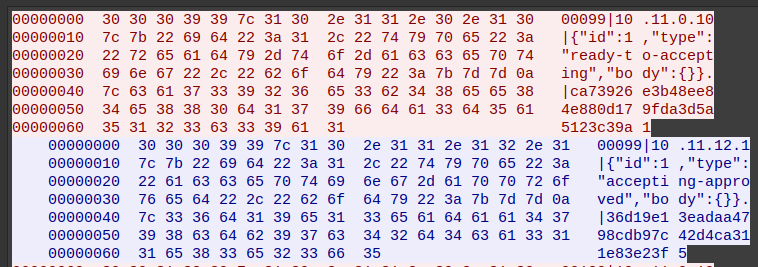

Причём в сообщении передаётся ip-адрес внутри VPN сети. 

### Общение с хранилищем

Первые пакеты понятны, теперь посмотрим что происходит при общении с хранилищем.  

#### Tcpdump внутри контейнера

Для этого воспользуемся тем же `tcpdump`, но запустим его внутри сети контейнера.

Это можно сделать двумя способами:
1. Классический:
   - поставить внутри `tcpdump`
   - "провалиться" в соседнем терминале в контейнер через `docker exec -ti <id of container>`
   - запустить `tcpdump`
   - сделать добро ~~и бросить его в воду~~
   - прервать `tcpdump`
   - вытащить дамп из контейнера через `docker cp`
2. Не классический:
  Для трафика нужна только сеть, а сеть в контейнерах - это свой сетевой неймспейс. В линукс можно заспавнить процесс внутри неймспейса с помощью `nsenter`.
  Нужно только узнать `pid` процесса внутри целевого неймспейса.

Полная команда для второго варианта:
```bash
sudo nsenter -n --target $(docker inspect <id of container> | grep Pid | grep -P -o '\d+') -- tcpdump -i any -w inside_container.pcap
```

Таким образом можно запускать хостовые бинари, которые сохраняют файлы на хостовой системе, но сеть будет контейнерная.  

---

Вернёмся к анализу...  

Вот такие UDP пакеты клиент отправлял:  
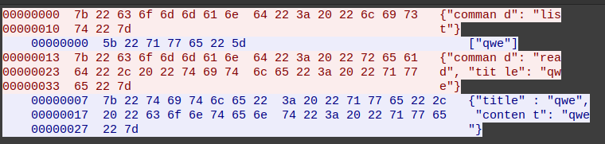

А вот, что было снаружи.  
Сначала было запрошено соединение (туннель) до `10.11.12.3` в первом TCP-стриме. Видимо, этот TCP-стрим - это управляющее соединение:  
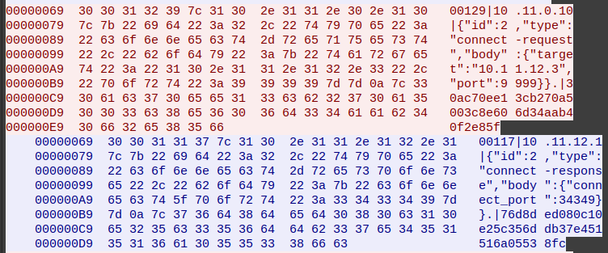

В ответе от VPN-сервера указан порт `34349`, отфильтровав по нему, увидим отправленное по UDP содержимое, но уже по TCP и обёрнутое в тот самый неизвестный формат:  
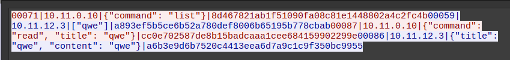


### Открытие чата

Также в трафике можно увидеть общение с реестром активных пользователей чата, который используется в клиенте чата:

До VPN:  
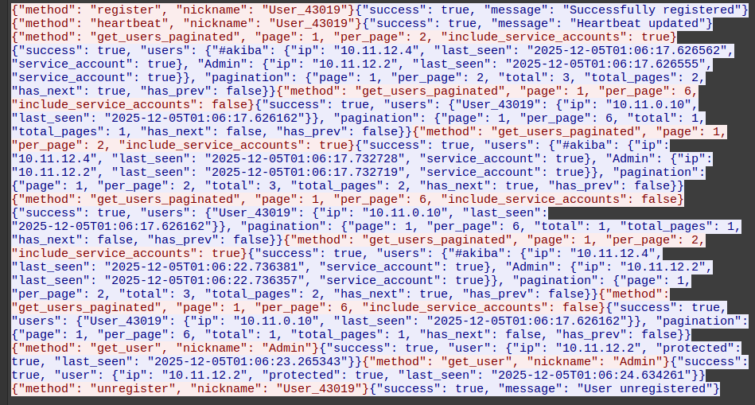

Снаружи VPN:  
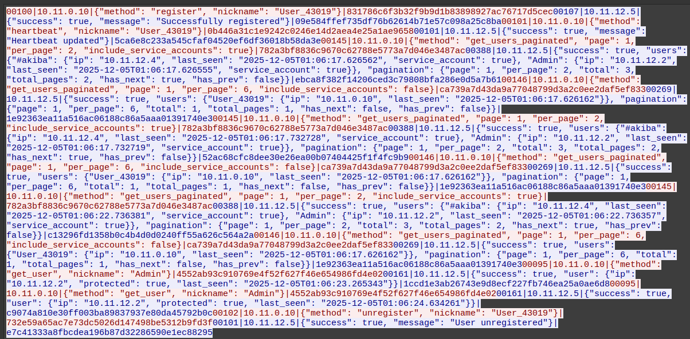

### Общение с админом

Само общение по чату с админом:  
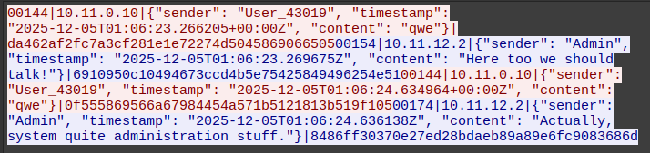

### Собираем информацию вместе

Какой из всего этого мы можем сделать вывод?  
У нас есть какой-то самописный VPN (на это ещё указывала текущая рабочая директория, которую мы видим при запуске контейнера `/root/vpn`).  

Также мы узнали, что внутри VPN сети есть::
 - `10.11.12.1` - ip сервера
 - `10.11.12.2` - ip админа
 - `10.11.12.3` - ip хранилища
 - `10.11.12.5` - ip справочника (реестра юзеров чата)

Также мы увидели структуру пакетов VPN'а:

```
<какое-то число>|<ip отправителя сообщение>|<json с сообщением>|<40 символов-хексов>
```

1. `какое-то число` - это скорее всего длина сообщения
2. `ip отправителя сообщения` - вероятно, это поле используется для идентификации удаленной стороны и VPN клиент прозрачно подставляет ip адреса
3. `json с сообщением` - payload пакета
4. `40 символов-хексов` - 40 символов, это 20 байт, то есть 160 бит, а это уже похоже на `SHA-1` и, вероятно, это подпись.

---

Итак в контейнере есть VPN-клиент, который и формирует подпись и использует для этого секрет, который передаётся в конфигурации. Этот секрет - единственная зацепка для сервера, по которой он может аутентифицировать VPN-клиента и сопоставить его со внутренним ip-адресом.

## Реверс VPN-клиента

Давайте посмотрим в исполняемый файл VPN-клиента, чтобы понять, как формируется подпись и как он вообще работает.
Путь до бинаря нашли ещё на [первых этапах](#окружение): `/usr/local/bin/vpn-client`


В IDA мы видим, что клиент был написан на Go. Интересует нас в первую очередь кастомная логика, а не стандартный рантайм Go.  
Таким образом находим функции из модуля `akiba-net` - выглядит как то, что нужно:  
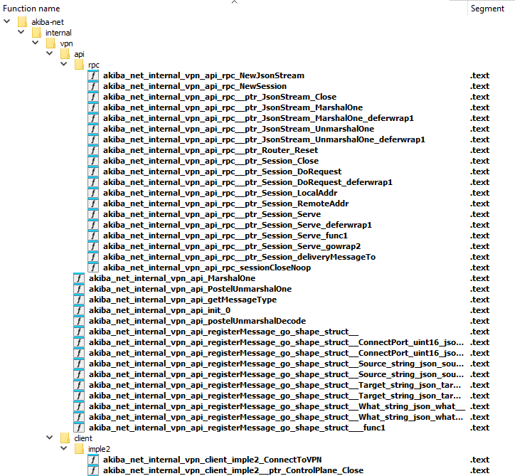

Среди его функций смотрим те, что обрабатывают сообщения. В частности, функция `akiba-net/internal/vpn/api.PostelUnmarshalOne` отвечает за парсинг - сначала достаёт само сообщение с помощью функции `postelUnmarshalDecode`, а затем парсит в RPC объект:

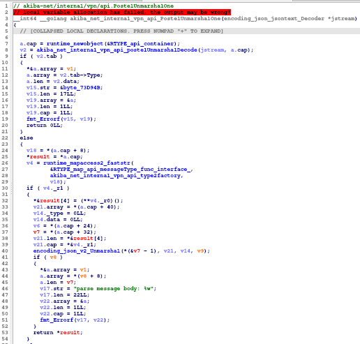

Сама функция `postelUnmarshalDecode` парсит не совсем обычным способом - в цикле проглатывает байты до тех пор, пока не увидит валидный json.

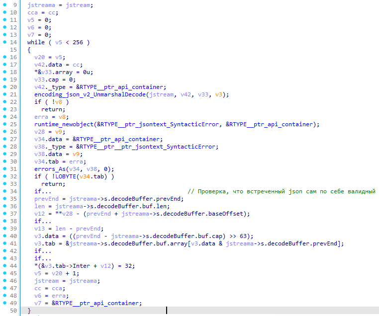

По её названию и способу работы можно понять, что клиент (и, скорее всего, сервер) реализуют Закон Постела, который появился на заре рождения глобальной сети и звучит так:

> Быть консервативным в том, что вы делаете, быть либеральным в том, что вы принимаете от других. 

То есть клиент должен отправлять всё максимально близко к стандарту протокола, но принимать может даже данные, не следующие строго стандарту, но смысл которых достаточно понятен из контекста.

Далее мы натыкаемся на две интересные функции: `akiba-net/internal/vpn/crypto.(*SingleSigner).Sign` и `akiba-net/internal/vpn/crypto.doHexSign`.

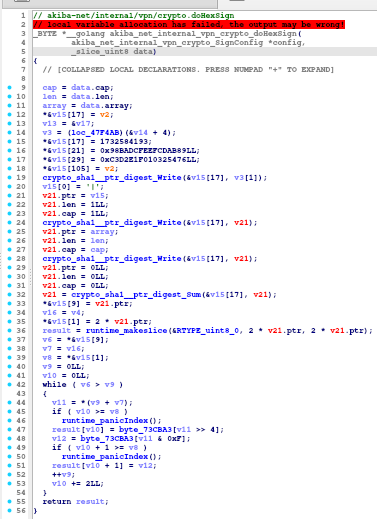

Что же мы можем из них узнать? Что подпись формируется как `sha1(<секрет>|<ip>|<json с сообщением>)`. Зная секрет (он же пароль), известный только клиенту и серверу, можно подписывать сообщения от имени этого клиента и выдать себя за него.

Но пароль админа никак не получить! Неужели придётся брутить хэши?...

## Атакуем SHA-1 удлинением сообщения

Поискав в интернете (или в [википедии](https://ru.wikipedia.org/wiki/SHA-1)), можно узнать, что такая "подпись" уязвима к [атаке удлинением сообщения](https://ru.wikipedia.org/wiki/%D0%90%D1%82%D0%B0%D0%BA%D0%B0_%D1%83%D0%B4%D0%BB%D0%B8%D0%BD%D0%B5%D0%BD%D0%B8%D0%B5%D0%BC_%D1%81%D0%BE%D0%BE%D0%B1%D1%89%D0%B5%D0%BD%D0%B8%D1%8F) - это с одной стороны. А с другой при парсинге используется закон Постела, который позволяет нам это применить, не беспокоясь о последствиях пересылки нечитаемых байтов после удлинения сообщения.

Воспользуемся, например, [Hash Extender](https://github.com/iagox86/hash_extender), предварительно поставив всё необходимое (`apt install git make gcc libssl-dev`).

Поставим инструмент на машину, используя:
```bash
git clone https://github.com/iagox86/hash_extender.git
cd hash_extender
make
cd ..
export PATH="$PATH:$(pwd)/hash_extender"
```

Пример работы:

```bash
hash_extender -f sha1 -d '|10.11.12.2|{"sender": "admin", "timestamp": "2025-09-28T13:49:38.405411+00:00Z", "content": "lolkek3000, what do you mean?"}' -s '0b10bc8ec47406828aea4f9697517f24601608a3' -a '{"id": 3, "type": "connect-request", "body": {"target": "10.11.12.3", "port": 9999}}' -l 32
```

Через `-d` указываем известную часть сообщения, после`-s` идёт значение хэша которое мы перехватили, через `-a` указываем, что хотим добавить, после `-l` идёт длина неизвестной части в байтах, в нашем случае это длина секрета.

В результате работы получим новый хэш и новую строку, которую мы должны отправить:

```
Type: sha1
Secret length: 32
New signature: 13002cfeedf5199711f49a3cc1b5a117b7257394
New string: 7c31302e31312e31322e327c7b2273656e646572223a202261646d696e222c202274696d657374616d70223a2022323032352d30392d32385431333a34393a33382e3430353431312b30303a30305a222c2022636f6e74656e74223a20226c6f6c6b656b333030302c207768617420646f20796f75206d65616e3f227d80000000000000000000000000000000000000000000000000000000000000000004e87b226964223a20332c202274797065223a2022636f6e6e6563742d72657175657374222c2022626f6479223a207b22746172676574223a202231302e31312e31322e33222c2022706f7274223a20393939397d7d
```

## План атаки

Чтобы прочитать секреты админа, нам надо представиться VPN-серверу админом и запросить туннель с хранилищем. Для этого нам нужно украсть его подпись и расширить, добавив наше сообщение.  
Подпись админа можно получить из трафика чата, а благодаря парсингу по закону Постела сервер отбросит и json-сообщения чата, и бинарные данные расширения.

Затем повторим расширение для сообщений внутри туннеля с хранилищем и достанем секреты.

> [!TIP]
> Как оказалось, несколько раз расширять не требовалось.  
> VPN-сервер и клиент не проверяли, что ip-адреса в сообщениях внутри туннеля и ip-адрес в управляющем сообщении совпадают. Проверялась только валидность подписи.
> Так что, было достаточно расширить только для управляющего сообщения, а внутри туннеля подписывать своей подписью.

Итого напишем скрипт, который будет за нас:
 - открывает соединения для общения с админом
 - пишет админу
 - получает ответ от админа
 - расширяет сообщение админа для установления соединения с хранилищем
 - расширяет сообщение админа для чтения списка заметок
 - расширяет сообщение админа для чтения заметки flag

Несколько часов отлаживаем скрипт и получаем флаг:

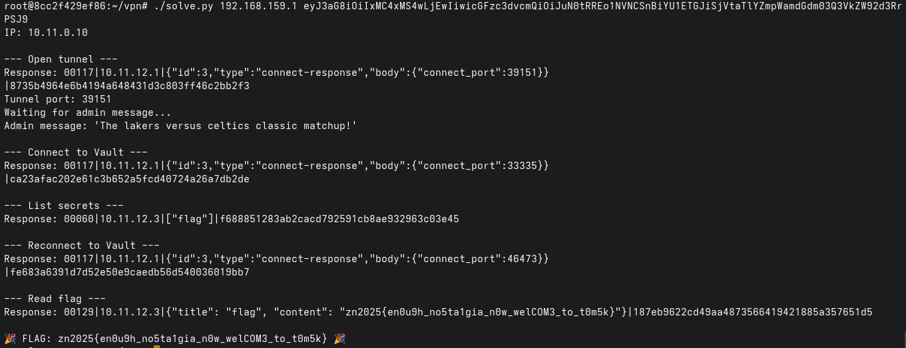

## Файлы

- [solve.py](./solve.py) - сам сплоит
- [inside_container.pcap](./inside_container.pcap) - трафик, снятый внутри контейнера со всех интерфейсов
- [outside_container.pcap](./outside_container.pcap) - трафик до VPN сервера, снятый снаружи контейнера
